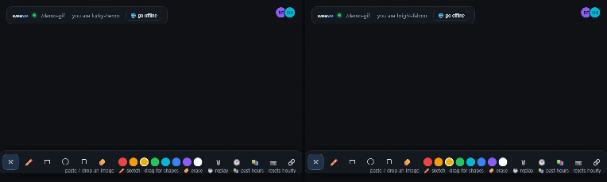
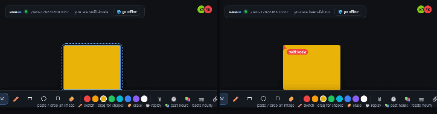
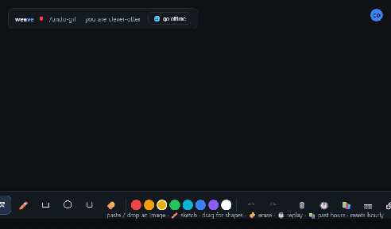
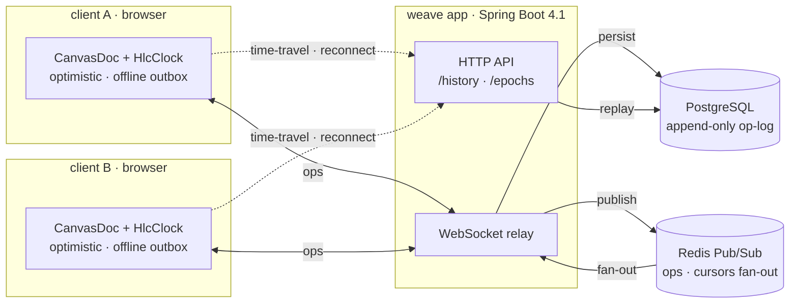
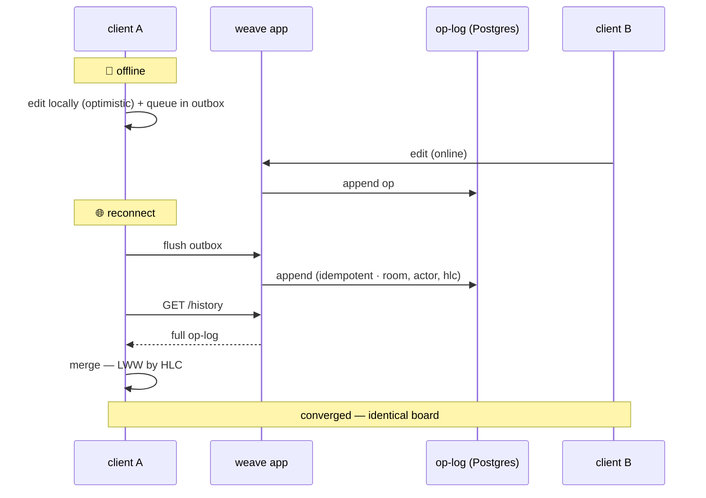
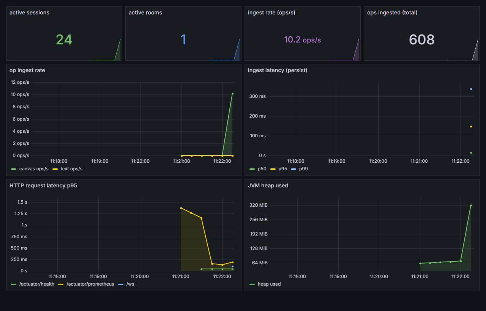

# weave

[](https://github.com/jinwovo/weave/actions/workflows/ci.yml)

> Real-time multiplayer canvas with a **hand-rolled CRDT**. Open the same room in two tabs and
> watch shapes, freehand ink, images and live cursors merge **conflict-free, with no server-side
> lock**. Go **offline**, keep drawing, reconnect — the two diverged boards snap back to the *same
> pixels*. And because every edit is an immutable op, you can **scrub the board's whole history**
> like a video.

**messaging is delivery. weave is _convergence_.** The hard part isn't the WebSocket — it's the
replicated data type underneath that makes concurrent edits provably agree, and the event-sourced
op-log that turns "every change ever" into time-travel.



---

## Why it's different

Every distinctive feature falls out of the **architecture**, not bolted-on UI:

| Feature | Powered by |
|---|---|
| 🟢 **Multiplayer, conflict-free** — concurrent edits never clobber | the CRDT (LWW-Map over HLC) |
| ✍️ **Collaborative text** — two people type in one note, character by character | a **sequence CRDT (RGA)**, proven by a fault-injection sim |
| ↶ **Undo / redo** — Ctrl+Z works *with* live collaboration, not against it | **inverse ops** re-authored with a fresh stamp (LWW always wins) |
| 🔌 **Offline-resilient** — keep editing while disconnected, reconnect → auto-merge | optimistic local CRDT + op outbox + reconcile |
| 🕐 **Time-travel** — scrub / replay the board's entire history | the append-only op-log (event sourcing) |
| 📚 **Hourly board + archive** — fresh canvas each hour, past hours browsable read-only | op-log bucketed by room `base@<hour>` |
| 🖼 **Images** (paste / drop), ✏️ **ink**, ▭ **shapes**, ⤡ **resize**, 🧽 **erase** | all just shapes in the same convergent document |

## Problem

Multiplayer editing (Figma / Excalidraw / tldraw) needs shared state that:

1. lets many people edit the same object **simultaneously** without a central lock,
2. **survives offline** edits and reconnects without losing work, and
3. **converges** — every replica that has seen the same edits shows the identical board.

A naïve "broadcast every change" approach silently diverges the moment two people touch the same
thing at once. The correct tool is a **CRDT** (Conflict-free Replicated Data Type), and the
correctness has to be *proven*, not eyeballed.

## Design

A board is a **map `shapeId → ShapeState`**. Every property of a shape is an independent
**Last-Writer-Wins register** stamped with a **Hybrid Logical Clock** timestamp + actor id
(globally unique, totally ordered). `merge` is the field-wise → key-wise **least upper bound**,
which is commutative, associative and idempotent — a **join-semilattice**, the sufficient condition
for convergence. Operations are applied by merging the delta they imply, so they are immune to
reordering and duplication. The server is a dumb relay + persistence layer, never the source of
truth.

The same op-log is also an **event store**: replaying any *prefix* of it reconstructs the board at
that moment — which is exactly what powers **time-travel**. And a room is bucketed as
`base@<hoursSinceEpoch>`, so the live board **resets every hour** while each past hour stays
preserved under its own room id and remains browsable.

See [`docs/adr/0001-lww-map-crdt-over-hlc.md`](docs/adr/0001-lww-map-crdt-over-hlc.md) for the
decision and the alternatives (OT, RGA/YATA, OR-Set, off-the-shelf Yjs) that were rejected.

LWW is the right call for geometry and style, but **text** has to merge character-by-character — so
text content is a **sequence CRDT (RGA)** of its own (`crdt-core/RgaText`): every character is an
element with a unique HLC id, concurrent inserts order deterministically, deletes are tombstones, and
ops buffer until their dependency arrives so it converges in any order. It backs sticky / text shape
bodies live — double-click a note and two people can type into it at once. See
[`docs/adr/0002-rga-sequence-crdt.md`](docs/adr/0002-rga-sequence-crdt.md).



**Undo/redo** falls out of the same model. There is no "previous document" to rewind to — the log is
append-only and shared — so each local edit records an **inverse op** (move → move-back, create →
delete, delete → re-create) that undo re-authors with a *fresh* timestamp. Because the board is
last-writer-wins, a fresh stamp always wins, so "undo" is just "author the reverse edit now" — which
commutes with everyone else's concurrent edits: undo my move after you recolor the same shape and
your color stays. Per-user stack, zero server involvement. See
[`docs/adr/0003-inverse-op-undo.md`](docs/adr/0003-inverse-op-undo.md).



## Architecture



A client applies each op to its local `CanvasDoc` **immediately** (optimistic), then sends it over the
WebSocket. The relay **persists it to the append-only op-log** and **publishes it to Redis**; the Redis
echo is the *single* broadcast path, so every instance — the origin included — relays an op to its own
sockets. A late joiner gets a snapshot; **time-travel** and the **hourly archive** read that same op-log
over HTTP. The server stores and fans out — it never decides the state; the CRDT does.

### Offline → reconnect → reconverge

The op-log + CRDT make a dropped connection a non-event: keep editing, reconnect, and the diverged
boards merge by themselves.



## Verification

The convergence guarantee is enforced by **property-based tests** (`jqwik`), not anecdotes:

- **order- & duplication-independence** — any delivery order of an op-log yields the same doc;
- **partition → gossip → convergence** — replicas that each saw only a slice of the edits all
  reconcile to the identical board after exchanging state;
- **semilattice laws** — `merge` is commutative, associative and idempotent;
- **HLC algorithm** — monotonic ticks, counter reset on physical progress, receive-side advance;
- **sequence CRDT (RGA)** — concurrently-authored text ops, delivered in every order with duplicates,
  converge to one string (character-level, not LWW);
- **deterministic fault-injection simulation** — a Jepsen-lite / DST harness: 3–4 replicas under an
  adversarial network (delay, reorder, drop-and-redeliver, duplicate) converge across **400 seeds**,
  every run reproducible from its seed.

```bash
./gradlew :crdt-core:test     # 18 tests
```

The **sync server** is proven end-to-end against real Postgres + Redis (Testcontainers): ops
authored by one WebSocket client fan out to another, land in the durable op-log **exactly once** (a
duplicate is absorbed by the `(room, actor, hlc)` constraint), and a late-joining client converges
to the identical board **from the snapshot alone** — purely by replaying the op-log through the CRDT.

```bash
./gradlew :app:test           # 7 tests (Testcontainers PG + Redis)
```

**Multi-instance convergence** is proven by `MultiInstanceConvergenceTest`, which boots **two app
contexts** sharing one Postgres + Redis and asserts an op authored on instance 1 reaches a client on
instance 2 — only possible via the Redis fan-out. A k6 load test ([`load/convergence.js`](load/convergence.js))
across a 2-instance cluster measured op fan-out latency at **median 16 ms · p90 70 ms** for ~100 ops/s
(77k messages fanned out, p99 ≈ 550 ms tail on a cold local run).

```bash
k6 run load/convergence.js    # against two instances on :8103 and :8104
```

## Stack

- **crdt-core** — pure Java 21, **zero production dependencies**; tests on `jqwik` + JUnit 5.
- **app** — Spring Boot 4.1: WebSocket relay, idempotent op-log on PostgreSQL (Flyway), Redis pub/sub
  fan-out, snapshot replay, and HTTP `…/history` + `…/epochs` endpoints (time-travel & archive).
- **web** — Next.js 15 + Canvas client: shapes, freehand pen, sticky text, **images** (paste/drop),
  resize, eraser, **undo/redo** (Ctrl+Z), live cursors, presence. A faithful **TypeScript port of the CRDT** gives
  local-first optimistic edits that converge with the server and every client — including **offline**
  edits that flush + reconcile on reconnect. Plus **time-travel** replay and the **hourly archive**.
- **observability** — Micrometer metrics on `/actuator/prometheus`, scraped by Prometheus into a
  provisioned **Grafana** dashboard: active sessions/rooms, op ingest rate + persist latency
  (p50/p95/p99 via histogram buckets), HTTP p95 per route, JVM heap.



Local ports (per workspace registry): app **8103**, PostgreSQL **5437**, Redis **6383**,
front **3009**, Prometheus **9099**, Grafana **3011**. Container prefix `weave-`.

## Roadmap

| Phase | Scope | Status |
|---|---|---|
| **P0** | Pure-Java CRDT core (LWW-Map over HLC) + property-based convergence proof | ✅ done |
| **P1** | Spring Boot 4.1 sync server: WebSocket relay, idempotent op-log, Redis fan-out, snapshot replay | ✅ done |
| **P2** | Next.js + Canvas client: shapes, pen, sticky text, images, resize, eraser, live cursors, presence | ✅ done |
| **P3** | Distinctive layer: **time-travel** replay · **offline → reconnect reconvergence** · **hourly board + archive** | ✅ done |
| **P4** | Multi-instance convergence (two app instances share Postgres + Redis) + k6 fan-out-latency load test | ✅ done |
| **P5** | Playwright two-client demo GIF + product polish (PNG export, copy-link) | ✅ done |
| **P6** | Sequence CRDT (RGA) collaborative text + deterministic fault-injection sim · Prometheus + Grafana observability | ✅ done |
| **P7** | Undo / redo via **inverse ops** — per-user, concurrency-safe, zero server change | ✅ done |

## Quickstart

```bash
git clone https://github.com/jinwovo/weave && cd weave

./gradlew :crdt-core:test     # P0 convergence proofs (no Docker needed)

docker compose up -d          # weave-postgres (5437) + weave-redis (6383)
./gradlew :app:test           # sync-server proof (Testcontainers spins its own PG + Redis)
./gradlew :app:bootRun        # run the sync server on http://localhost:8103  (WS: /ws?room=&actor=)

cd web && npm install && npm run dev    # canvas client on http://localhost:3009
# open two tabs at http://localhost:3009/?room=demo — draw, paste an image, go offline, hit 🕐 / 📚
```
